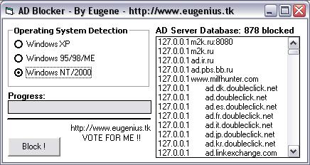



## Block Web Advertisements before they are even downloaded \! \(AD Blocker 1\.0\)

### Description

Block WEB Advertisements before they are even downloaded, you can save all your precious BANDWIDTH or just stop being bothered by all those AD's on web pages ! Just download and take a look, test it and VOTE FOR ME !!
 
### More Info
 

             |
---                |---
**Submitted On**   |2002-11-24 21:25:30
**By**             |[Eugene P\.](https://github.com/Planet-Source-Code/PSCIndex/blob/master/ByAuthor/eugene-p.md)
**Level**          |Beginner
**User Rating**    |4.7 (33 globes from 7 users)
**Compatibility**  |VB 5\.0, VB 6\.0
**Category**       |[Miscellaneous](https://github.com/Planet-Source-Code/PSCIndex/blob/master/ByCategory/miscellaneous__1-1.md)
**World**          |[Visual Basic](https://github.com/Planet-Source-Code/PSCIndex/blob/master/ByWorld/visual-basic.md)
**Archive File**   |[Block\_Web\_15030311252002\.zip](https://github.com/Planet-Source-Code/eugene-p-block-web-advertisements-before-they-are-even-downloaded-ad-blocker-1-0__1-41030/archive/master.zip)

